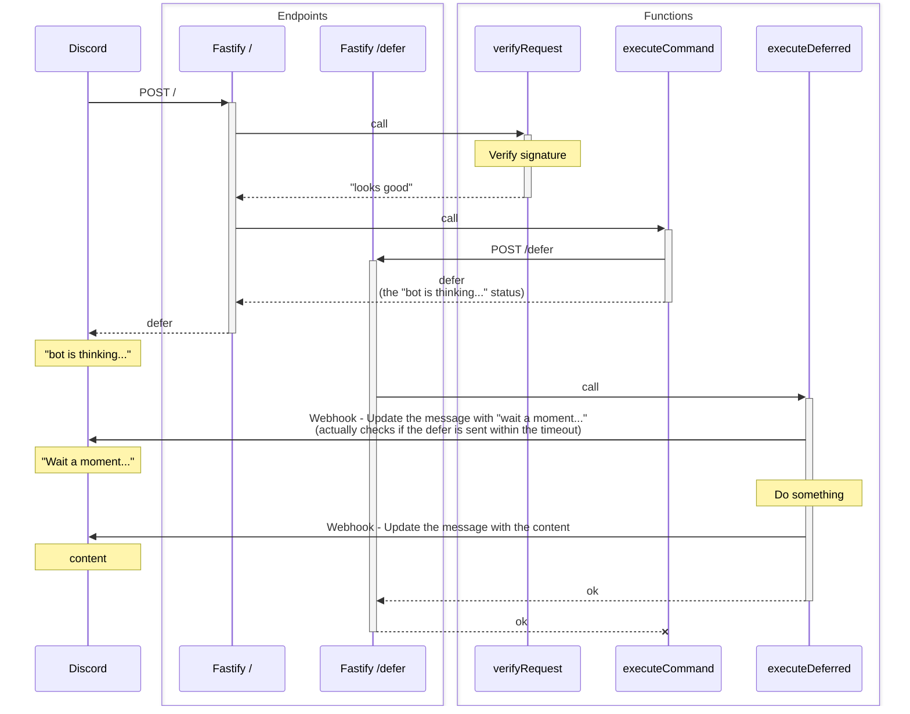

# How does it work?

```mermaid
sequenceDiagram
  participant discord as Discord

  box Endpoints
    participant index as Fastify /
    participant defer as Fastify /defer
  end

  box Functions
    participant verify as verifyRequest
    participant command as executeCommand
    participant deferred as executeDeferred
  end

  discord ->>+ index: POST /
  index ->>+ verify: call
  Note over verify: Verify signature
  verify -->>- index: "looks good"
  index ->>+ command: call
  command ->>+ defer: POST /defer
  command -->>- index: defer<br>(the "bot is thinking..." status)
  index -->>- discord: defer
  Note over discord: "bot is thinking..."
  defer ->>+ deferred: call
  deferred ->> discord: Webhook - Update the message with "wait a moment..."<br>(actually checks if the defer is sent within the timeout)
  Note over discord: "Wait a moment..."
  Note over deferred: Do something
  deferred ->> discord: Webhook - Update the message with the content
  Note over discord: content
  deferred -->>- defer: ok
  defer --x- command: ok
```
